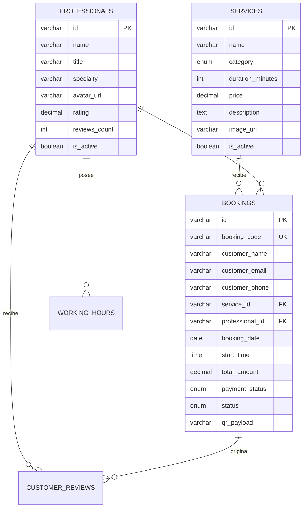

# Aura Booking — Plataforma Web de Reservas Multi-Step de Lujo

[](https://alxnrocha.github.io/booking-app/)
[](https://react.dev/)
[](https://www.typescriptlang.org/)
[](https://tailwindcss.com/)
[](https://www.mysql.com/)
[](https://www.mysql.com/)
[](https://github.com/pmndrs/zustand)
[](https://zod.dev/)
[](https://vitest.dev/)
[](https://oxc.rs/)
[](LICENSE)

> **Proyecto 13 del Portafolio Profesional** — Motor de reservas y gestión de citas premium para spa, estética VIP y consultoría de alto nivel.  
> 🔗 **Demo en Vivo en GitHub Pages:** [https://alxnrocha.github.io/booking-app/](https://alxnrocha.github.io/booking-app/)

---

## 🌟 Visión General & Propuesta de Valor

**Aura Booking** es una Single Page Application (SPA) de alta fidelidad diseñada para ofrecer una experiencia de reserva de servicios de lujo fluida, intuitiva y visualmente impactante. 

Combina un **flujo guiado de 4 etapas (Multi-Step Wizard)** con validaciones reactivas en tiempo real, persistencia local de borradores, prevención estricta de concurrencia y generación de un **Voucher Digital estilo Boarding Pass con Código QR dinámico**.

---

## ✨ Características Principales

1. **🎨 Estética Luxury Dark Mode:**
   - Paleta cromática refinada con fondo Dark Slate (`#0B0E14`), acentos en Oro Champagne (`#E5B56A`) y paneles translúcidos con Glassmorphism.
   - Tipografía noble con *Playfair Display* para títulos y *Plus Jakarta Sans* para interfaces tabulares y campos interactivos.

2. **🪄 Flujo Multi-Step (4 Fases Interactivas):**
   - **Paso 1 (Catálogo de Servicios):** Selección de rituales de belleza y bienestar con fotos HD, duración estimada (`45 min`, `60 min`, `120 min`), precios y filtros por categoría (*Massage, Hair Styling, Facial Spa, Wellness*).
   - **Paso 2 (Especialista & Calendario):** Calendario mensual interactivo con selección de día, asignación de terapeuta (*Isabella Moretti, Matteo Rossi, Sofia Laurent, Elena Vance*) y selector de turnos (*Morning, Afternoon, Evening*) con slots libres.
   - **Paso 3 (Datos del Cliente & Pago):** Formulario robusto validado con **React Hook Form + Zod** (nombre, correo electrónico, prefijo internacional con selector de país, notas/alergias opcionales con contador de caracteres) y método de liquidación (*Pay Now* con tarjeta cifrada vs *Pay at Venue*).
   - **Paso 4 (Voucher & Confirmación):** Ticket interactivo perforado con código de reserva `#AUR-XXXX`, previsualización de mapa oscuro de Milán, código QR escaneable y opciones para exportar a **Google Calendar**, **Apple Wallet** e impresión en PDF.

3. **⚡ Panel Lateral Sticky Reactivo:**
   - Acompaña al cliente en cada etapa actualizando al instante el subtotal, tasa de servicio (€10.00), IVA (22%), cupón de descuento promocional y total final en dorado.
   - Botón de retroceso inteligente y acceso directo a edición rápida (*Quick Edit*).

4. **🔒 Control de Concurrencia en Tiempo Real:**
   - Motor en `src/utils/schedulingEngine.ts` que bloquea automáticamente los horarios reservados para evitar doble agendamiento (*Double Booking Prevention*).

5. **💼 Módulo "Mis Reservas" (Lookup & Cancellation):**
   - Buscador rápido en tiempo real por código de voucher (`#AUR-9482`), nombre o email.
   - Gestión y cancelación de citas con liberación inmediata de la franja horaria.

---

## 🏛️ Arquitectura del Proyecto

```text
13-booking-app/
├── .github/
│   └── workflows/
│       └── ci.yml               # Pipeline de CI (Lint, Test, Build)
├── database/
│   ├── schema.sql               # DDL MySQL 8.4 LTS con restricciones UNIQUE
│   ├── seed.sql                 # Datos de prueba para profesionales y servicios
│   └── README.md                # Diagrama DER Mermaid y diccionario de datos
├── design/
│   └── design_completo.png      # Mockup visual de referencia
├── src/
│   ├── components/
│   │   ├── booking/
│   │   │   ├── BookingStepper.tsx
│   │   │   ├── BookingSummarySidebar.tsx
│   │   │   ├── CalendarGrid.tsx
│   │   │   ├── ConfirmationStep.tsx
│   │   │   ├── CustomerDetailsStep.tsx
│   │   │   ├── DateTimeStep.tsx
│   │   │   ├── MyBookingsModal.tsx
│   │   │   ├── PaymentSummary.tsx
│   │   │   ├── ServiceCard.tsx
│   │   │   ├── ServiceSelectionStep.tsx
│   │   │   ├── SpecialistCard.tsx
│   │   │   ├── TimeSlotPicker.tsx
│   │   │   └── VoucherTicket.tsx
│   │   └── layout/
│   │       └── Navbar.tsx
│   ├── data/
│   │   └── mockBookingData.ts   # Fixtures de datos determinísticas
│   ├── schemas/
│   │   └── bookingSchema.ts     # Esquemas de validación Zod
│   ├── stores/
│   │   └── useBookingStore.ts   # Store global Zustand 5 con persistencia
│   ├── tests/                   # Pruebas de integración y accesibilidad
│   ├── types/
│   │   └── booking.ts           # Interfaces y tipos del dominio
│   ├── utils/
│   │   └── schedulingEngine.ts  # Algoritmos de horarios y concurrencia
│   ├── App.tsx
│   ├── index.css
│   └── main.tsx
├── package.json
├── tsconfig.json
└── vite.config.ts
```

---

## 📊 Diagrama Entidad-Relación (MySQL 8.4 LTS)



---

## 🚀 Instalación y Puesta en Marcha

### Prerrequisitos
- Node.js `>= 22.0.0`
- npm `>= 10.0.0`

### Pasos

1. **Clonar el repositorio:**
   ```bash
   git clone https://github.com/alxnrocha/booking-app.git
   cd booking-app
   ```

2. **Instalar dependencias:**
   ```bash
   npm install
   ```

3. **Ejecutar en modo desarrollo:**
   ```bash
   npm run dev
   ```
   Abrir [http://localhost:5173](http://localhost:5173) en el navegador.

4. **Ejecutar la suite de pruebas automatizadas (Vitest):**
   ```bash
   npm test
   ```

5. **Ejecutar el linter (Oxlint):**
   ```bash
   npm run lint
   ```

6. **Compilar el bundle de producción:**
   ```bash
   npm run build
   ```

---

## 🛡️ Calidad de Código & Testing

- **32 Pruebas Unitarias e Integración:** Cobertura de cálculos financieros, validaciones Zod, navegación por pasos, persistencia en `sessionStorage`, bloqueo de horarios y accesibilidad.
- **Oxlint:** Cero advertencias y cero errores en la totalidad del código fuente.
- **Accesibilidad (a11y):** Semántica ARIA completa, modales accesibles con cierre por `Escape` y anillos de foco visibles.

---

## 📄 Licencia

Este proyecto se encuentra bajo la Licencia MIT. Consulta el archivo [LICENSE](LICENSE) para más detalles.
