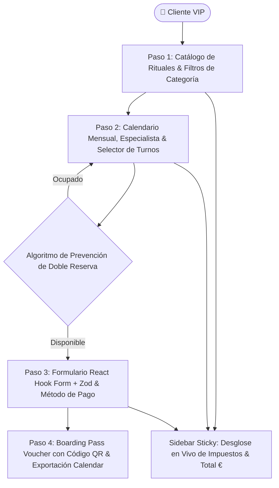

# Aura Booking — Plataforma Web de Reservas Multi-Step de Lujo

<div align="center">


**Motor de reservas y gestión de citas de lujo en 4 fases interactivas con validación Zod, prevención estricta de doble reserva, generación de voucher digital con código QR y estética Dark Gold Glassmorphism.**

[🚀 Demo en Vivo](https://alxnrocha.github.io/booking-app/) • [📂 Repositorio en GitHub](https://github.com/alxnrocha/booking-app)

</div>

---

## 🏛️ Arquitectura y Flujo de Reserva



---

## ✨ Características Principales

1. **🎨 Estética Luxury Dark Mode:**
   - Paleta cromática refinada con fondo Dark Slate (`#0B0E14`), acentos en Oro Champagne (`#E5B56A`) y paneles translúcidos con Glassmorphism.
   - Tipografía *Playfair Display* para títulos y *Plus Jakarta Sans* para interfaces tabulares y campos interactivos.

2. **🪄 Flujo Multi-Step (4 Fases Interactivas):**
   - **Paso 1 (Catálogo de Servicios):** Selección de rituales con duración (`45 min`, `60 min`, `120 min`), precios y filtros por categoría (*Massage, Hair Styling, Facial Spa, Wellness*).
   - **Paso 2 (Especialista & Calendario):** Calendario mensual interactivo con selección de día, terapeuta asignado y turnos libres (*Morning, Afternoon, Evening*).
   - **Paso 3 (Datos del Cliente & Pago):** Formulario robusto validado con **React Hook Form + Zod** y método de liquidación (*Pay Now* vs *Pay at Venue*).
   - **Paso 4 (Voucher & Confirmación):** Ticket interactivo perforado con código `#AUR-XXXX`, código QR escaneable y opciones para Google Calendar y PDF.

3. **⚡ Panel Lateral Sticky Reactivo:**
   - Acompaña al cliente en cada etapa actualizando al instante el subtotal, tasa de servicio (€10.00), IVA (22%), cupón de descuento y total final.

4. **🔒 Control de Concurrencia en Tiempo Real:**
   - Algoritmo en `schedulingEngine.ts` que bloquea automáticamente los horarios reservados para evitar doble agendamiento (*Double Booking Prevention*).

5. **💼 Módulo "Mis Reservas" (Lookup & Cancellation):**
   - Buscador rápido por código de voucher (`#AUR-9482`), nombre o email con liberación inmediata de franja horaria.

---

## 🗂️ Estructura del Proyecto

```text
13-booking-app/
├── database/
│   ├── schema.sql               # DDL MySQL 8.4 LTS con restricciones UNIQUE
│   └── seed.sql                 # Datos de prueba para profesionales y servicios
├── src/
│   ├── components/
│   │   ├── booking/             # Stepper, CalendarGrid, SpecialistCard, VoucherTicket
│   │   └── layout/              # Navbar, Footer
│   ├── schemas/                 # Esquemas de validación Zod
│   ├── stores/                  # Store global Zustand 5 con persistencia
│   ├── types/                   # Interfaces y tipos TypeScript del dominio
│   ├── utils/                   # Algoritmos de horarios y concurrencia
│   ├── App.tsx
│   └── main.tsx
├── tests/                       # 32 pruebas unitarias e integración con Vitest
├── package.json
├── tsconfig.json
└── vite.config.ts
```

---

## 🚀 Instalación y Puesta en Marcha

### Prerrequisitos
- Node.js `>= 20.0.0`
- npm `>= 10.0.0`

### Ejecución Local
```bash
# 1. Clonar el repositorio
git clone https://github.com/alxnrocha/booking-app.git
cd booking-app

# 2. Instalar dependencias
npm install

# 3. Iniciar servidor de desarrollo
npm run dev

# 4. Ejecutar suite de pruebas unitarias (32 tests)
npm test

# 5. Compilar para producción
npm run build
```

---

## 🛠️ Tecnologías Utilizadas

| Capa | Tecnología | Aspectos Clave |
|---|---|---|
| **Framework** | React 19 | Arquitectura Multi-Step, Stepper desacoplado |
| **Lenguaje** | TypeScript 5.8 | Modelado estricto de citas, servicios y especialistas |
| **Estado Global** | Zustand 5.0 | Persistencia en sesión, sincronización de sidebar |
| **Validación** | Zod 3.24 | Esquemas de validación de formulario y formato telefónico |
| **Testing** | Vitest | 32 pruebas unitarias de concurrencia y cálculos |
| **Despliegue** | GitHub Pages | Despliegue estático continuo y optimizado |

---

<div align="center">
  <sub>Desarrollado con dedicación por <a href="https://github.com/alxnrocha">Alex Rocha</a> • Proyecto 13 del Portafolio Profesional Frontend.</sub>
</div>
