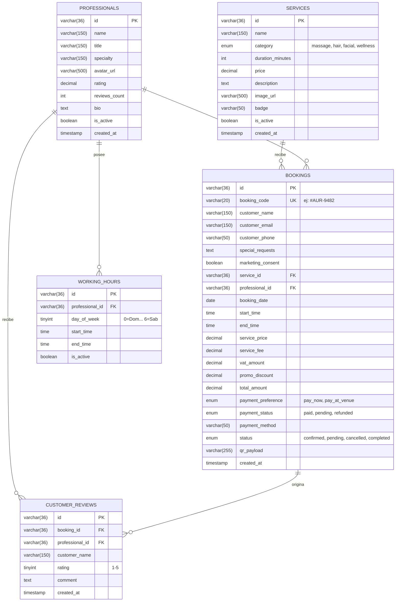

# Modelo Relacional de Base de Datos (MySQL 8.4 LTS) — Aura Booking

Documentación técnica del esquema relacional y restricciones de integridad para el sistema de reservas multi-step de alta concurrencia.

---

## 📊 Diagrama Entidad-Relación (Mermaid DER)



---

## 🔒 Control de Concurrencia y Restricciones Clave

1. **Prevención de Doble Reserva (Double Booking Prevention):**
   ```sql
   UNIQUE KEY uq_prof_schedule (professional_id, booking_date, start_time)
   ```
   Garantiza a nivel de motor de base de datos (`InnoDB`) que un mismo terapeuta/especialista jamás pueda tener dos citas superpuestas en el mismo bloque temporal.

2. **Integridad Referencial:**
   - La eliminación de un servicio o especialista activo está restringida (`ON DELETE RESTRICT`) si existen citas asociadas en `bookings`.
   - La eliminación de un profesional elimina en cascada sus horarios de trabajo (`ON DELETE CASCADE`).

3. **Optimización de Índices:**
   - Búsqueda de reservas por código de voucher (`idx_bookings_code`).
   - Consultas de agenda por fecha (`idx_bookings_date`) y cliente (`idx_bookings_email`).
